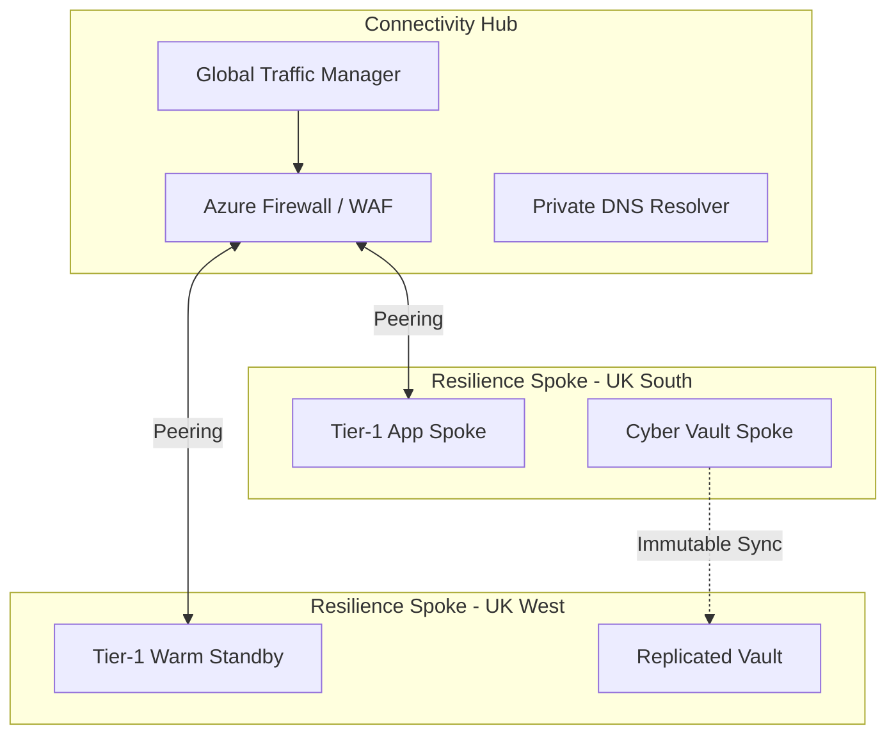
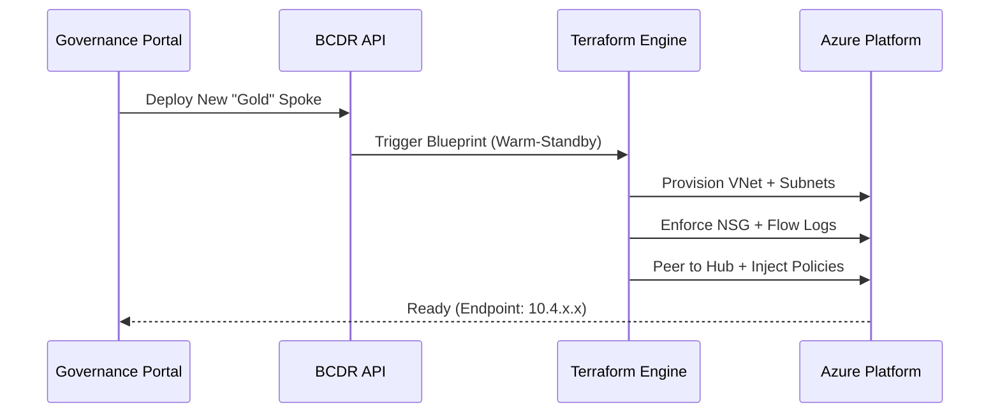
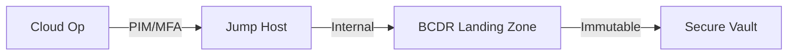

<div align="center">


<h1>BCDR Landing Zone</h1>

<p><strong>The Enterprise Flagship Foundation for Resilient Cloud Infrastructures, Disaster Recovery Spokes, and Cyber Recovery Vaults</strong></p>

[]()
[]()
[]()
[]()

<br/>

> **"Resilience starts at the foundation."** 
> BCDR Landing Zone is a production-hardened platform engineered to provide secure, policy-driven cloud environments for global recovery platforms and mission-critical backup estates.

</div>

---

## 🏛️ Architecture Overview

The BCDR Landing Zone utilizes a multi-region Hub-and-Spoke topology with integrated regional isolation.



### 💉 Landing Zone Vending Lifecycle



---

## 🚀 Business Outcomes

- **Zero-Trust Resilience**: 100% of BCDR Spokes are private-link enabled; no public ingress for recovery controllers.
- **Rapid Provisioning**: Reduce environment setup for new DR workloads from weeks to < 10 minutes.
- **Immutability Assurance**: Automatic configuration of "locked" storage accounts for cyber recovery workloads.
- **Global Visibility**: Consolidated heatmap of resilience posture across all global cloud instances.

---

## 📂 Repository Structure

```text
bcdr-landingzone/
├── apps/
│   ├── portal/             # Next.js 14 Management Dashboard
│   ├── api/                # FastAPI Core Resilience Gateway
│   ├── governance-engine/  # Policy Enforcement Workers
│   ├── network-engine/     # Hub-Spoke Orchestrator
│   └── cost-engine/        # DR Spend Optmization Engine
├── terraform/              # Enterprise Landing Zone IaC
│   ├── modules/            # Hardened Network, Vault, and Compute
│   └── environments/       # Global Region Topology (Prod/DR)
├── security/               # Cyber Recovery Controls & RBAC
├── monitoring/             # Prometheus & Alerting Rules
├── .github/workflows/      # Resilience CI/CD Pipelines
└── README.md               # Boardroom Product Documentation
```

---

## 🚀 Deployment Guide

### 1. Provision Global Hub (Terraform)
The base layer of connectivity and security inspection.

```bash
cd terraform/hub
terraform init
terraform apply -auto-approve
```

### 2. Vend a Resilience Spoke
Use the CLI or API to create a production-ready standby zone.

```bash
curl -X POST https://api.bcdr-lz.com/v1/spokes/deploy \
     -d '{"name": "payments-dr", "model": "pilot-light"}'
```

---

## 🛡️ Security Trust Boundary



- **PIM/PAM**: All infrastructure changes require Just-In-Time role elevation.
- **Data Posture**: No public access points for any BCDR Spoke. All traffic routes via encrypted ExpressRoute/VPN backbones.
- **Governance**: Every resource is scanned for "Resilience-Tier" tags. Non-compliant resources are auto-quarantined.

---

## 🤝 Support & Roadmap
- **Deployment Support**: support@devopstrio.com
- **Enterprise Status**: [Status Page](https://status.devopstrio.com)

<div align="center">


**Building the future of enterprise infrastructure — one blueprint at a time.**

</div>
